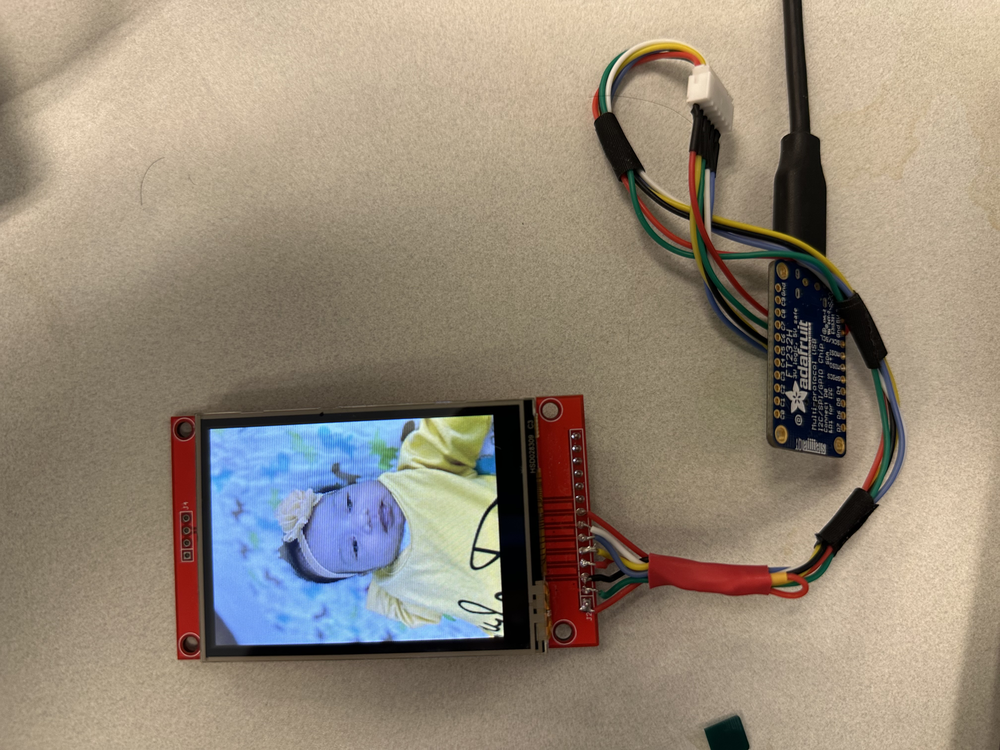

# Python Library for ILI9341 Driven LCD displays Connected with 4-wire SPI

This library implements a python driver for SPI-connected ILI9341 LCD displays.
Only the 4-wire SPI interface having an additional data-control select pin
`DC/X` is supported.

It takes inspiration from `Adafruit_Python_ILI9341` project. Most constants and
some of the timing values are copied as is. The focus is to display arbitrary
image in the display and increase SPI bandwidth-limited framerate by doing
automatic partial updates.

## Advantages

- Supports a variety of hardware and software interfaces:
  - Spidev + Gpiod
  - Mraa
  - Pyftdi
- Fast and efficient buffer update, taking advantage of the partial update
  commands of the ILI9341 chip.


## Hardware Connections

The host needs to have an SPI connection along with a general GPIO output for
the `DC/X` pin. The library does one way communication only and as such, the
`MISO` pin can be left unconnected. Connections for the tests are described in
the test scripts and is printed during test invocation.

The tests were done using a
[2.8inch ILI9341 display](http://www.lcdwiki.com/2.8inch_SPI_Module_ILI9341_SKU:MSP2807).
The datasheet of the LCD driver chip can be found
[here](https://cdn-shop.adafruit.com/datasheets/ILI9341.pdf).




## Installation and Testing

- [Spidev + Gpiod in Ubuntu 22.04](docs/ubuntu_22.04_spidev_setup.md)
- [Pyftdi in Ubuntu 22.04](docs/ubuntu_22.04_pyftdi_setup.md)
- [Mraa in Ubuntu 22.04](docs/ubuntu_22.04_mraa_setup.md)


## Usage examples

Here some examples of using different interfaces with Raspberry Pi 3B+.

### Using Spidev + Gpiod Interface

```python
from ili9341.ili9341_spidev import Ili9341Spidev

# Hardware connection:
# ------------------------------------------------------------------
# [RPi2B Compat. Host]   <---> [Display]
# ==================================================================
# Pin-19/GPIO-10/MOSI    <---> MOSI (Main-Out-Sub-In)
# Pin-23/GPIO-11/SCLK    <---> SCLK (SPI-Clock)
# Pin-24/GPIO-8/SPI0-CE0 <---> CS/X (SPI-Chip-Select)
# Pin-22/GPIO-25         <---> DC/X (Data/Control Select for ILI9341)
# 3.3V+                  <---> RST (We are not using reset pin)
# 3.3V+                  <---> LED (No software illumination control)

lcd = Ili9341Spidev(
    spidev_device_path="/dev/spidev0.0",
    gpiod_device_path="/dev/gpiochip0",
    dcx_pin_id=25,
    rst_pin_id=None,
    spi_clock_hz=42_000_000,
    spi_data_chunk_size=2048)

# Clear the screen to white.
lcd.clear((0xFF, 0xFF, 0xFF))

# Draw a red rectangle.
lcd.framebuff[10:20, 10:40, :] = (0xFF, 0, 0)
lcd.update()
```

### Using Pyftdi Interface

```python
from ili9341.ili9341_pyftdi import Ili9341Pyftdi

# Hardware connection:
# -------------------------------------------------------------------
# [FT232H] <---> [Display]
# ===================-===============================================
# D0       <---> SCLK (SPI-Clock)
# D1       <---> MOSI (Main-Out-Sub-In)
# D3       <---> CS/X (SPI-Chip-Select)
# D4       <---> DC/X (Data/Control Select for ILI9341)
# 3.3V+    <---> RST (We are not using reset pin)
# 3.3V+    <---> LED (No software illumination control)

lcd = Ili9341Pyftdi(
    pyftdi_interface_path="ftdi://ftdi:232h/1",
    dcx_pin_id=4,
    rst_pin_id=None,
    spi_clock_hz=42_000_000,
    spi_data_chunk_size=2048)

# Clear the screen to white.
lcd.clear((0xFF, 0xFF, 0xFF))

# Draw a red rectangle.
lcd.framebuff[10:20, 10:40, :] = (0xFF, 0, 0)
lcd.update()
```


### Using Mraa Interface

```python
from ili9341.ili9341_mraa import Ili9341Mraa

# Hardware connection:
# ------------------------------------------------------------------
# [RPi2B Compat. Host]   <---> [Display]
# ==================================================================
# Pin-19/GPIO-10/MOSI    <---> MOSI (Main-Out-Sub-In)
# Pin-23/GPIO-11/SCLK    <---> SCLK (SPI-Clock)
# Pin-24/GPIO-8/SPI0-CE0 <---> CS/X (SPI-Chip-Select)
# Pin-22/GPIO-25         <---> DC/X (Data/Control Select for ILI9341)
# 3.3V+                  <---> RST (We are not using reset pin)
# 3.3V+                  <---> LED (No software illumination control)

lcd = Ili9341Mraa(
    spi_id: 0,
    dcx_pin_id: 22,
    rst_pin_id=None,
    spi_clock_hz=42_000_000,
    spi_data_chunk_size=2048)

# Clear the screen to white.
lcd.clear((0xFF, 0xFF, 0xFF))

# Draw a red rectangle.
lcd.framebuff[10:20, 10:40, :] = (0xFF, 0, 0)
lcd.update()
```


## About the test data

The image and video inside the `tests/` directory are of my daughter. Isn't she
adorable? ^_^


## Some background on why

As part of my graduate research at University of South Carolina, Autonomous
Field Robotics Lab, my team embarked on a journey to make customized control and
user interface for an underwater autonomous robot, BlueROV from ground up. To
save some CPU cycles, using an SPI display seemed like a good idea, instead of
an HDMI display with Xorg/fbdev.

The Mraa interface was developed at first. Development was done with a Raspberry
Pi 3B+ and was later deployed on an 'Up Squared' - an X86 SBC.

We had to change the host computer in the middle of the design process and Mraa
interface didn't have support for the upgraded 'Up Squared V2' SBC. So, we
switched to Spidev + gpiod interface. Turns out, the Spidev driver for this
device is buggy and can not go beyond 1MHz. As an workaround, I developed
another interface based on FT232 USB-to-GPIO interface.


## License

This software is distributed under MIT license. Look at the `LICENSE` file for
the terms of distribution.


## Copyright

2024 Titon Barua <baruat@email.sc.edu, titon@vimmaniac.com>
